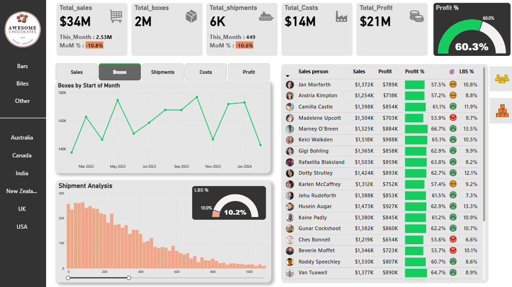

# PowerBi_chocolate_Sales_Analytics_Dashboard

See the Full Dashboard here - [App PowerBi Link](https://app.powerbi.com/view?r=eyJrIjoiZDBmMTA0YTgtOTNmNi00MzcwLWEzZGMtMjA0YWE0ODRjZTkwIiwidCI6ImM2ZTU0OWIzLTVmNDUtNDAzMi1hYWU5LWQ0MjQ0ZGM1YjJjNCJ9)

- This repository contains an interactive Chocolate Sales Dashboard built using Power BI.
- The project includes complete Power query data cleaning, data modeling, DAX calculations and visual storytelling.
- The goal is to analyze chocolate sales performance across products, countries, sales persons and category to help stakeholders make data-driven decisions.

# ⭐ Key Features & KPIs
📌 KPI's

- Total sales
- Total Boxes
- Total Shipments
- Total Costs
- Total Profit

📌 Slicers

- Category
- Country

📌 Visuals

- Gauge Visual - Profit %
- Line chart - Monthly changes in % of Sales, Boxes, Shipment, Costs and Profit
- Stacked Column chart - Low box shipment analysis (LBS count)
- Tables - Sales person & Product sales analysis

# 📈 Business Insights

✅𝐒𝐚𝐥𝐞𝐬 𝐀𝐧𝐚𝐥𝐲𝐬𝐢𝐬: 

➡️𝐒𝐚𝐥𝐞𝐬 𝐛𝐲 𝐈𝐭𝐞𝐦 𝐂𝐚𝐭𝐞𝐠𝐨𝐫𝐲: The bar chart shows that ‘Bars’ are the top-selling category, followed by ‘Bites’ and ‘Others.’ This indicates a preference for traditional chocolate bars among customers.

➡️𝐒𝐡𝐢𝐩𝐦𝐞𝐧𝐭𝐬 𝐛𝐲 𝐂𝐨𝐮𝐧𝐭𝐫𝐲 : The bar chart reveals that Australia has the highest number of shipments, followed by Canada, India, the UK, and the USA. This indicates strong international demand and efficient logistics operations.

✅𝐀𝐜𝐡𝐢𝐞𝐯𝐞𝐦𝐞𝐧𝐭𝐬 𝐚𝐧𝐝 𝐓𝐚𝐫𝐠𝐞𝐭𝐬 : 

The circular gauge shows a 60.3% achievement towards the company’s target, indicating progress and areas for improvement. 

✅𝐂𝐨𝐧𝐜𝐥𝐮𝐬𝐢𝐨𝐧 :

 The Power BI dashboard provides a comprehensive and visually appealing overview of the Chocolate Company’s performance. It highlights key metrics, sales trends, shipment efficiency, product performance and cost, sales volume and profit trends to strategize for future growth.

